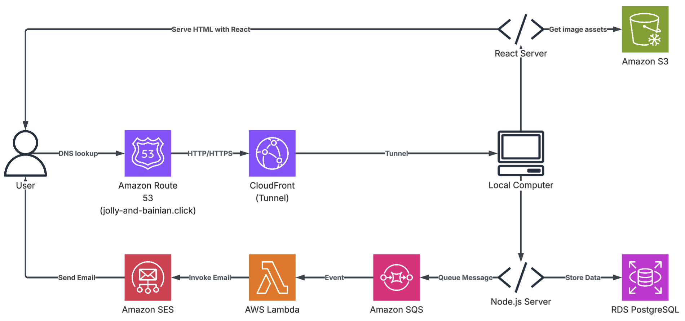

# Intoduction
This project was setup as a personal website to send wedding invitations.

## How to Run the Project
1. `npm run dev` from the `/frontend` project to start the React app.
2. `npm run clouflare` from the `/service` project to start the Cloudflare tunnel in another terminal window.
3. Authenticate yourself in the terminal for AWS.
4. `npm run dev` from the `/service` project to start the NodeJS server in terminal that's authenticated for AWS.

## Cloudflare Setup
1. Install cloudflare CLI: `brew install cloudflare/cloudflare/cloudflared`
2. Lgoin to Cloudflare: `cloudflared tunnel login`. This will save a cert to `~/.cloudflared/cert.pem`.
3. Create a tunnel: `cloudflared tunnel create jolly-and-bainian`. You should get a tunnel UUID and a cred file under `~/.cloudflared/<TUNNEL-UUID>.json`
4. Cloudflare would also need a `config.yml` under `~/.cloudflared`, which is committed and copied over to that directory by script under this git repo.

## How to Deploy AWS Resources
1. Authenticate yourself in the terminal for AWS
2. Install [AWS CLI](https://docs.aws.amazon.com/cli/latest/userguide/getting-started-install.html)
3. Go to the `/infra` folder
4. `cdk boostrap`
5. `cdk deploy`
6. To deploy the lambda function, go to `/service/lambda/emailSender` folder then run `npm run build`, then `npm run deploy`.

## How to Run Database Migrations
1. If first time ever running the migration, start by `npx prisma migrate resolve --applied 0_init` to mark the migration baseline.
2. Make your database schema changes in `prisma/schema.prisma`.
3. Run `npx prisma generate` to generate the prisma client code, so IDE can reference thems.
4. Run `npx prisma migrate dev --name VERSION_NAME` to generate and apply the migrations.